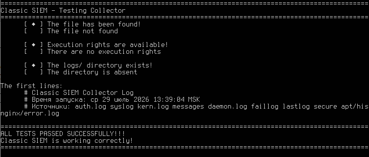
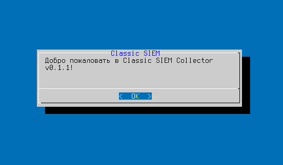
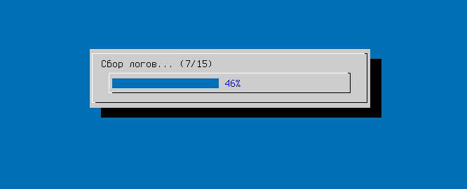
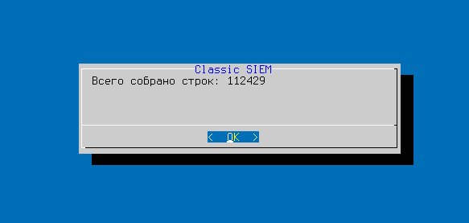
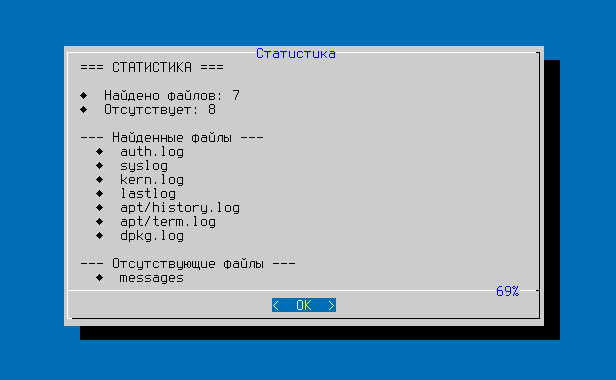
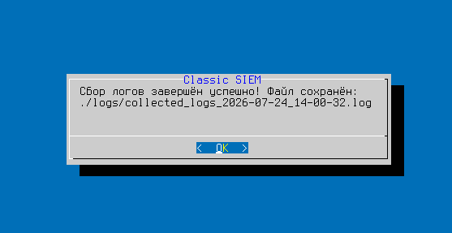
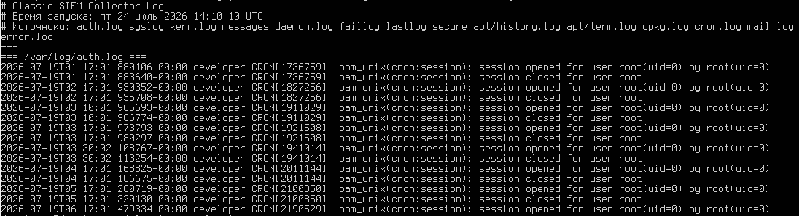

# Classic SIEM

**Платформа обнаружения угроз на чистом Bash**

Classic SIEM — это лёгкая, быстрая и прозрачная SIEM-система, написанная на Bash. Она собирает системные логи, приводит их к единому формату и анализирует с помощью правил корреляции для обнаружения атак.

---

## 🚀 Ключевые возможности

- ✅ **Сбор логов** — из `/var/log/auth.log`, `/var/log/syslog` и других источников.
- ⏳ **Нормализация** — приведение логов к единому формату (в разработке).
- 📋 **Корреляция** — обнаружение аномалий на основе правил (в плане).
- 🔔 **Алерты** — уведомления в Telegram (в плане).
- 🧠 **AI-аналитика** — обнаружение аномалий с использованием ИИ (в плане).

---

## 📂 Структура проекта

```text
classic-siem/
├── src/
│   ├── collector.sh        # Сбор логов из /var/log/
│   ├── normalizer.sh       # Нормализация событий (в разработке)
│   └── correlator.sh       # Корреляция и правила (в плане)
├── logs/                   # Собранные логи
├── config/
│   └── settings.conf       # Настройки
└── README.md
```

---  


## ⚙️ Быстрый старт  
Клонируй репозиторий и запусти сбор логов:  
```bash  
git clone https://github.com/Reitrel/classic-siem.git  
cd classic-siem  
chmod +x src/collector.sh  
./src/collector.sh  
```

---

## 🧪 Тестирование

Проект включает автоматические тесты для проверки работоспособности модулей.

### Что проверяется

Тест `test_collector.sh` выполняет следующие проверки:

| № | Проверка | Что делает |
|---|----------|------------|
| 1 | **Наличие файла** | Проверяет, существует ли `src/collector.sh` |
| 2 | **Права на выполнение** | Проверяет, есть ли у файла права `+x`. Если нет — добавляет |
| 3 | **Директория для логов** | Проверяет, существует ли папка `logs/`. Если нет — будет создана при запуске |
| 4 | **Создание лог-файла** | Запускает `collector.sh` и проверяет, что создался файл с логами |


### Запуск тестов

```bash
# Перейти в папку проекта
cd classic-siem

# Запустить тестовый скрипт
./tests/test_collector.sh
```

### Ожидаемый результат

Все проверки должны быть пройдены успешно:



Если какая-то проверка не пройдена — тест укажет на проблему и завершится с кодом ошибки.

---


## 📌 Статус разработки
| Модуль	    |      Статус  |
|-------------|-------------------|
|Collector	  |  ✅ Готов        |
|Normalizer	  |  ⏳ В разработке  |
|Correlator	  |  📋 Запланирован  |
|Alerter      |  📋 Запланирован  |
|Web-интерфейс|  📋 Запланирован  |


---

## 📸 Демонстрация работы

Ниже представлены скриншоты, иллюстрирующие процесс работы модуля Collector в Classic SIEM.

### 1. Приветственное окно
При запуске скрипта появляется диалоговое окно с приветствием.



### 2. Прогресс сбора логов
Скрипт показывает прогресс-бар, отображающий текущий статус сбора.



### 3. Статистика по данным
Выводится статистика сколько всего собрано строк.



### 4. Статистика по файлам
После завершения сбора отображается статистика: сколько файлов найдено, сколько пропущено, и их список.



### 5. Завершение работы
Финальное окно с адресом к сохранённому файлу.



### 6. Пример собранных логов
Первые 20 строк собранного лог-файла.



---

## 🎥 Видеодемонстрация

Полный процесс работы модуля Collector можно посмотреть на видео:

[Видео: работа Classic SIEM Collector](demo/collector_demo.wmv)

---


## 📬 Контакты
- **Сайт:** [classic-siem.ru](https://classic-siem.ru)  
- **Почта:** [support@classic-siem.ru](mailto:support@classic-siem.ru)  
- **VK:** [SIEM Navigation](https://vk.com/cyber_siem)  
- **Дзен:** [Канал на Дзен](https://dzen.ru/a/akZNi6H1F0km-5yk)  
- **GitHub:** [Reitrel/classic-siem](https://github.com/Reitrel/classic-siem)

---

📜 **Лицензия**  
Проект распространяется под лицензией GNU General Public License v3.0.
