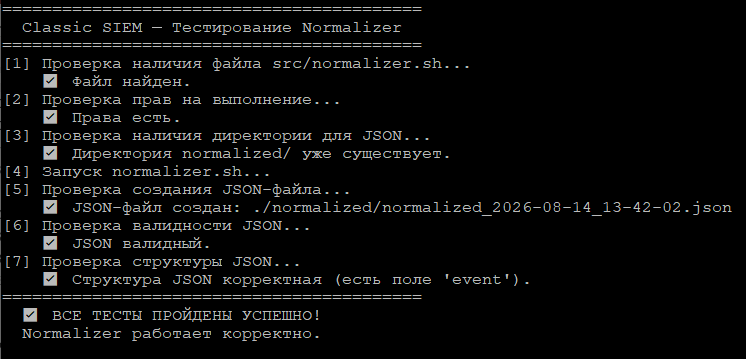
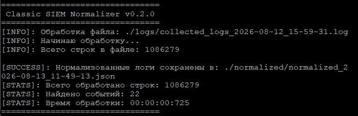

# Classic SIEM

**Платформа обнаружения угроз на Bash и AWK**

Classic SIEM — это лёгкая, быстрая и прозрачная SIEM-система, написанная на Bash. Она собирает системные логи, приводит их к единому формату и анализирует с помощью правил корреляции для обнаружения атак.

---

## 🚀 Ключевые возможности

- ✅ **Сбор логов** — из `/var/log/auth.log`, `/var/log/syslog` и других источников (модуль Collector)
- ✅ **Нормализация** — приведение логов к единому формату JSON (AWK, **1M+ строк/сек**)
- 📋 **Корреляция** — обнаружение аномалий на основе правил (в плане)
- 🔔 **Алерты** — уведомления в Telegram (в плане)
- 🧠 **AI-аналитика** — обнаружение аномалий с использованием ИИ (в плане)

---

## 🛠 Технологии

- **Bash** — управление модулями, автоматизация
- **AWK** — высокопроизводительный парсер логов (1M+ строк/сек)
- **jq** — проверка и форматирование JSON
- **Linux** — системные логи, среда выполнения
- **Git** — контроль версий
- **Cron** — автоматизация задач по расписанию (в плане)

---

## 📂 Структура проекта

```text
classic-siem/
├── demo/                   # Демонстрационное видео работы
│   └── collector_demo.wmv
├── screenshots/            # Скриншоты интерфейса и тестов
│   ├── 01_welcome.png
│   ├── 02_progress.png
│   ├── 03_stats.png
│   ├── 04_stats.png
│   ├── 05_complete.png
│   ├── 06_logs_sample.png
│   ├── 07_test_collector.png
│   ├── 01_normalizer_start.png
│   └── 01_test_normalizer.png
├── src/                    # Исходный код модулей
│   ├── collector.sh        # ✅ Сбор логов из /var/log/
│   └── normalizer.sh       # ✅ Нормализация в JSON (AWK, 1M+ строк/сек)
├── tests/                  # Автоматические тесты
│   ├── test_collector.sh   # Тесты для проверки collector.sh
│   └── test_normalizer.sh  # Тесты для проверки normalizer.sh
├── logs/                   # Собранные логи (игнорируется Git)
├── config/
│   └── settings.conf       # Настройки (в плане)
├── .gitignore              # Файлы, исключённые из Git
├── LICENSE                 # GNU General Public License v3.0
└── README.md               # Описание проекта
```

---

## ⚙️ Быстрый старт

Клонируй репозиторий и запусти сбор логов:

```bash
git clone https://github.com/Reitrel/classic-siem.git
cd classic-siem
chmod +x src/collector.sh
./src/collector.sh
```

После сбора логов запусти нормализацию:
chmod +x src/normalizer.sh
./src/normalizer.sh

---

## 📌 Статус разработки

| Модуль | Статус | Производительность |
|--------|--------|-------------------|
| Collector | ✅ Готов | — |
| Normalizer | ✅ Готов (v0.2.2) | **~1 550 000 строк/сек** |
| Correlator | 📋 Запланирован | — |
| Alerter | 📋 Запланирован | — |
| Web-интерфейс | 📋 Запланирован | — |

---

## 🧪 Тестирование

Проект включает автоматические тесты для проверки работоспособности модулей.

### Тестирование Collector

Тест `test_collector.sh` выполняет следующие проверки:

| № | Проверка | Что делает |
|:---:|----------|------------|
| 1 | Наличие файла | Проверяет, существует ли `src/collector.sh` |
| 2 | Права на выполнение | Проверяет, есть ли у файла права `+x`. Если нет — добавляет |
| 3 | Директория для логов | Проверяет, существует ли папка `logs/`. Если нет — будет создана при запуске |
| 4 | Создание лог-файла | Запускает `collector.sh` и проверяет, что создался файл с логами |

**Запуск:**

```bash
./tests/test_collector.sh
```

**Ожидаемый результат:**

Все проверки должны быть пройдены успешно:


---

### Тестирование Normalizer

Тест `test_normalizer.sh` выполняет следующие проверки:

| № | Проверка | Что делает |
|:---:|----------|------------|
| 1 | Наличие файла | Проверяет, существует ли `src/normalizer.sh` |
| 2 | Права на выполнение | Проверяет, есть ли у файла права `+x`. Если нет — добавляет |
| 3 | Директория для JSON | Проверяет, существует ли папка `normalized/`. Если нет — будет создана при запуске |
| 4 | Запуск нормализатора | Запускает `normalizer.sh` |
| 5 | Создание JSON-файла | Проверяет, что создался JSON-файл |
| 6 | Валидность JSON | Проверяет, что JSON валидный (через `jq`) |

**Запуск:**

```bash
./tests/test_normalizer.sh
```

**Ожидаемый результат:**

Все проверки должны быть пройдены успешно:



---

## 📸 Демонстрация работы модуля **collector.sh**

### 1. Приветственное окно


### 2. Прогресс сбора логов


### 3. Статистика по данным


### 4. Статистика по файлам


### 5. Завершение работы


### 6. Пример собранных логов


---

## 🎥 Видеодемонстрация модуля **collector.sh**

[Видео: работа Classic SIEM Collector](demo/collector_demo.wmv)

---

## 📸 Демонстрация работы модуля **normalizer.sh**

### 1. Запуск Normalizer


---

## 📬 Контакты

- **Сайт:** [classic-siem.ru](https://classic-siem.ru)
- **Почта:** [support@classic-siem.ru](mailto:support@classic-siem.ru)
- **VK:** [SIEM Navigation](https://vk.com/cyber_siem)
- **Дзен:** [Канал на Дзен](https://dzen.ru/a/akZNi6H1F0km-5yk)
- **GitHub:** [Reitrel/classic-siem](https://github.com/Reitrel/classic-siem)

---

## 📜 Лицензия

Проект распространяется под лицензией **GNU General Public License v3.0**.

---

**Сделано на Bash и AWK. Для тех, кто ценит скорость и контроль.**
